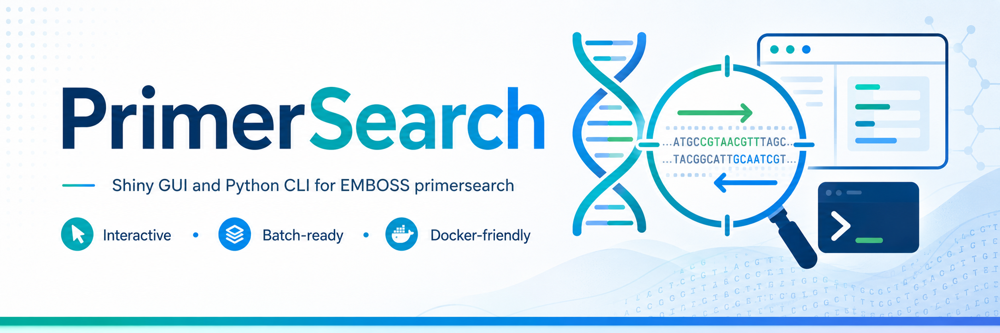

<p align="center">
  
</p>

# PrimerSearch GUI and CLI

**PrimerSearch** provides a simple graphical interface and a command-line workflow to run **EMBOSS primersearch** on genome files.

It is designed for both:

- **Non-coders**, using the Shiny graphical interface.
- **Bioinformaticians**, using the Python CLI for automation and batch analyses.

## Features

- Interactive **Shiny GUI** for easy primer screening.
- **Python CLI** for reproducible and automated runs.
- **Docker-friendly** setup for users without local EMBOSS installation.
- Template files for primers, configuration, and container settings.
- Local data files are ignored by git to avoid committing large or sensitive files.

## Repository layout

```text
.
├── run_primersearch.py              # CLI script
├── primersearch_gui/                # Shiny app and Docker helper
├── templates/                       # Starter config, primers, and container files
├── assets/                          # Logo and GitHub banner
└── README.md
```

## Quick start: Docker, no local install

This is the easiest option for non-coders. It uses a helper script that builds and runs the container for you.

### 1. Copy template files

```bash
cp templates/container.env primersearch_gui/container.env
cp templates/primers.tsv primers.tsv
cp templates/primersearch_config.json primersearch_config.json
```

### 2. Edit `primersearch_gui/container.env`

Open `primersearch_gui/container.env` with a text editor and set the following values:

```bash
GENOMES_DIR=
GENOMES_MOUNT=/data/GENOMES
SHINY_MAX_UPLOAD_MB=500
```

Where:

- `GENOMES_DIR`: path to your genomes on your computer.
- `GENOMES_MOUNT`: path used inside the container, default `/data/GENOMES`.
- `SHINY_MAX_UPLOAD_MB`: maximum upload size in MB. Increase this value for large genomes.

If `GENOMES_DIR` is empty, you can upload the genome file directly through the GUI.

### 3. Build and start the app

```bash
bash primersearch_gui/run_container.sh
```

### 4. Open the app in your browser

```text
http://localhost:3838
```

### 5. Use the GUI

In the Shiny interface:

- Upload `primers.tsv`.
- Upload `primersearch_config.json`, optional.
- Provide the genome either:
  - by file upload, or
  - by path if genomes were mounted in the container.

If you mounted genomes, use paths such as:

```text
/data/GENOMES/my_genome.fasta
```

## Local GUI usage with Shiny

Use this option if you already have **R**, **Shiny**, and **EMBOSS** installed locally.

```bash
conda activate emboss_suite_env
R -e 'shiny::runApp("primersearch_gui")'
```

Then open the local Shiny app in your browser.

## CLI usage

Use the CLI for pipelines, automation, and batch runs.

### 1. Copy template files

```bash
cp templates/primers.tsv primers.tsv
cp templates/primersearch_config.json primersearch_config.json
```

### 2. Edit the configuration file

Open `primersearch_config.json` and set the path to your genome file.

Example:

```json
{
  "genome": "path/to/genome.fasta",
  "primers": "primers.tsv",
  "output_dir": "primersearch_work"
}
```

Adapt the values according to your project structure.

### 3. Run PrimerSearch

```bash
conda activate emboss_suite_env
python3 run_primersearch.py --config primersearch_config.json
```

## Input files

### Primer file

The primer file should be a tab-separated file.

Example:

```text
primer_name	forward_primer	reverse_primer
PrimerSet_01	ATGCGTACGTAGCTAGCTAG	CGATCGATCGTACGTACGTA
PrimerSet_02	TTGACCGTATCGATCGATCG	AACCGGTTAACCGGTTAACC
```

A starter file is available here:

```text
templates/primers.tsv
```

### Configuration file

A starter configuration file is available here:

```text
templates/primersearch_config.json
```

Use this file to define paths and run parameters for the CLI or GUI workflow.

## Output files

PrimerSearch creates output files in the working directory defined by the configuration file or by the GUI.

Typical output folders include:

```text
primersearch_work/
primersearch_gui/runs/
```

These folders are ignored by git.

## Notes about data and git

The following local files are ignored by git:

```text
primers.tsv
primersearch_config.json
primersearch_work/
primersearch_gui/runs/
primersearch_gui/container.env
```

Use the files in `templates/` as clean starting points.

This avoids committing:

- local genome paths,
- user-specific configuration,
- large analysis outputs,
- temporary files,
- container-specific settings.

## Requirements

Depending on the usage mode, you need one of the following setups.

### Docker mode

Recommended for most users.

Required:

- Docker
- Bash shell

No local EMBOSS or R installation is required.

### Local GUI mode

Required:

- R
- Shiny
- EMBOSS primersearch

### CLI mode

Required:

- Python 3
- EMBOSS primersearch
- A configured environment such as `emboss_suite_env`

## Why both GUI and CLI?

PrimerSearch is distributed with both a graphical interface and a command-line interface because the two modes target different users and use cases.

The **Shiny GUI** is intended for interactive use, especially by users who want to test primers without writing code.

The **Python CLI** is intended for automation, reproducibility, and integration into larger bioinformatics workflows or pipelines.

## Citation

If you use this repository in a project, please cite or reference the repository URL.

## License

Add your license information here.
